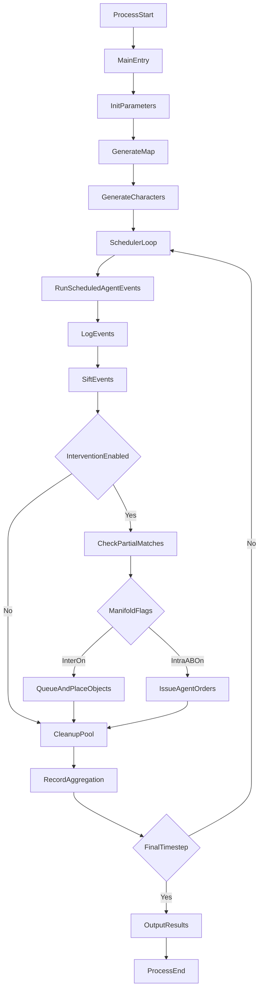

# Alien Invasion Simulation - Technical Documentation

## 1) Repository Structure Summary

This repository is a multi-agent simulation system that models interactions among `ALIEN`, `SOLDIER`, and `TOWNSFOLK` agents in a procedurally generated town. It combines:
- simulation runtime,
- map and agent generation,
- event abstraction/story extraction,
- optional drama-manager intervention,
- and post-run analytics.

### Top-level layout

- `main.js`: runtime entrypoint.
- `Scheduler.js`: simulation tick loop and orchestration.
- `Utils.js`: global constants, enums, and runtime parameters.
- `Logger.js`: event/state/result output pipeline.
- `Config.js`: legacy randomized config helper.
- `Character/`: character data model, shared behavior, concrete agent classes, and creation manager.
- `Map/`: map generation and spatial entities (`Road`, `Building`, `Gear`).
- `StorySifter/`: pattern-based event abstraction from low-level logs.
- `DramaManager/`: dual-manifold intervention system — intra-manifold agent orders (`IntraManifoldABIntervention.js`) and inter-manifold map object spawning (`InterManifoldIntervention.js`).
- `Aggregation/`: clustering/dispersion metrics (NND, Clark-Evans, PCF).
- `analyze_data.py`, `visualize_neutral_data.py`, `enhanced_visualization.py`: post-processing scripts for neutral-agent logs.
- `MyScript.sh`: batch runner for repeated simulation runs.

### Data/output artifact directories

These hold generated logs/results and are not part of runtime APIs:
- `DM_Test/`
- `StableTest/`
- `Ratio_0/`, `Ratio_1/`
- `ComplexityTest_0/`, `ComplexityTest_1/`

## 2) Purpose of the System

The system simulates combat/survival dynamics in a small city under alien invasion, with optional narrative intervention.

Primary goals:
- generate time-evolving low-level interaction events,
- infer higher-level event patterns ("stories"),
- optionally intervene to increase specific story outcomes,
- and measure spatial aggregation dynamics over time.

Core outputs per run:
- raw event logs (`Log.txt`),
- state snapshots (`StatesLog.txt`),
- summary results (`Results.txt`),
- order reports (`IssuedOrderResults.txt`, `ExecutedOrderResults.txt`),
- map dump (`CityMap.txt`),
- per-beat population snapshots (`PopulationInfo.txt`),
- and optional stable-test aggregate lines.

## 3) Architecture and Major Modules

### Runtime pipeline overview

1. `main.js` parses CLI args and initializes parameters.
2. `Map/MapManager.js` generates map and initial gears.
3. `Character/CharactersManager.js` creates/schedules agents.
4. `Scheduler.js` runs tick loop (`jssim` scheduler).
5. Agent updates produce low-level events through `Logger.info(...)`.
6. `StorySifter` updates partial matches and emits high-level events.
7. `DramaManager` (when enabled) inspects partial matches and applies intra- and/or inter-manifold interventions.
8. `Aggregation` records clustering metrics per tick.
9. `Logger` writes final result files.

### Major module responsibilities

- **Runtime bootstrap:** `main.js`, `Utils.js`
- **Simulation loop:** `Scheduler.js`
- **World model:** `Map/*`
- **Agent behavior:** `Character/*`
- **Event extraction/story model:** `StorySifter/*`
- **Narrative control:** `DramaManager/*` (intra-manifold orders + inter-manifold object placement)
- **Spatial analysis:** `Aggregation/*`
- **Persistence/output:** `Logger.js`

## 4) Workflow Diagram

## 5) Module-by-Module Documentation

## Root Runtime Modules

### `main.js`

- `main()`
  - Purpose: application entrypoint.
  - Inputs: CLI args (`timeSteps`, `totalCharacters`, `characterRatio`, `mapSize`, `dirNameIdx`).
  - Outputs: none (process-driven flow).
  - Side effects: initializes global parameters, generates world, and starts scheduler.

### `Utils.js`

- `initParameters(totalCharacters, characterRatio, mapSize, timeSteps)`
  - Purpose: set runtime globals from CLI/config input.
  - Side effects: mutates exported runtime constants (`TOTAL_CHARACTERS`, per-type counts, `MAP_SIZE`, `TIME_STEPS`).
- `getNumberByRatio(characterType)`
  - Purpose: compute count per character type from ratio and total.
- `formatString(template, ...args)`
  - Purpose: template replacement utility for log strings.

Exported constants/enums include:
- `CHARACTER_TYPE`, `CHARACTER_STATES`, `NEUTRAL_STATES`
- `DIRECTION`
- `GEAR_TYPES`, `HEALS`, `WEAPONS`, `HEAL_STEP`, `GEAR_STATE`
- `HEALTH_STATES`, `OBJECT_TYPE`
- control flags:
  - `INTRA_MANIFOLD_AB_ENABLED` — enable weak action-based intra-manifold intervention (agent orders),
  - `INTER_MANIFOLD_ENABLED` — enable inter-manifold intervention (spawn agents/gear on map),
  - `IS_GUIDED_INTER_MANIFOLD` — when inter-manifold is on, use guided placement vs dumped placement,
  - plus `TOTAL_CHARACTERS`, `MAP_SIZE`, `TIME_STEPS`.

### `Scheduler.js`

- `updateEvents(totalTimeSteps)`
  - Purpose: top-level tick loop around `jssim` scheduler.
  - Inputs: total simulation ticks.
  - Outputs: none.
  - Side effects:
    - executes all scheduled agent events every tick,
    - flushes logger queues,
    - records Clark-Evans aggregation values,
    - when `INTRA_MANIFOLD_AB_ENABLED` or `INTER_MANIFOLD_ENABLED` is true:
      - runs drama-manager partial-match intervention checks,
      - when `INTER_MANIFOLD_ENABLED` is true, places queued inter-manifold objects each beat via `DramaManager.addObjectOnMap()`,
    - records per-beat population snapshots via `Logger.recordPopulationInfo()`,
    - cleans story pool (`Pool.cleanUpPool`),
    - writes `PopulationInfo.txt` at finalization,
    - emits final reports (`Results.txt`, stable-test aggregate, order result files).
  - Note: per-beat partial-match/story-created recording helpers exist on `Logger` but are currently commented out in the scheduler loop.

Exports:
- `scheduler` (singleton `jssim.Scheduler`)
- `updateEvents`

### `Logger.js`

`Logger` is a mutable singleton-like object handling all run outputs.

- `Logger.info(infoJson)`: assigns event ID, appends event log, forwards event to `StorySifter`.
- `Logger.generateUniqueID()`: monotonic event ID generation.
- `Logger.statesInfo(infoStr)`: append state log lines and periodic keyframes.
- `Logger.setKeyFrame()`: snapshot all agents' position/state.
- `Logger.countNeutralAgents(currentTime)`: log neutral/alive counts.
- `Logger.writeToFile()`: flush event/state queues to output files.
- `Logger.outputFinalResults(executionTime, timeSteps)`: write `Results.txt`.
- `Logger.outputStableTestResults(executionTime, timeSteps)`: append batch/stability JSON line.
- `Logger.outputOrderResults()`: write issued/executed order files.
- `Logger.recordPartialMatchCreatedEachBeat(count)`: queue one per-beat created-partial-match count.
- `Logger.recordPartialStoryCreatedEachBeat(count)`: queue one per-beat created-partial-story count.
- `Logger.recordPopulationInfo(time)`: queue one per-beat population snapshot object.
- `Logger.writePopulationInfoToFile()`: flush queued population snapshots to `PopulationInfo.txt`.
- `Logger.clearQueue()`: clear in-memory queues.
- `Logger.getDirName()`: derive run directory and ensure it exists.
- `Logger.getDirNameWithoutIdx()`: derive base output directory by drama-mode.
- `Logger.setDirNameIdx(idx)`: assign per-run output index.

### `Config.js`

- `generateMapSize()`: random map size selection from predefined candidates.
- `generateCharacterNum()`: random character count selection from predefined candidates.

Exports random-at-load configuration values:
- `MAP_SIZE`, `ALIENS_NUM`, `TOWNFOLKS_NUM`.

## Character Module

### `Character/Character.js`

- `class Character`
  - `constructor(name, position)`: minimal character shell.
  - `walk(direction)`: move one step with bounds checks.
  - `walkWithRandomDirection()`: random movement.
  - `run()`, `pickUp()`, `knowledge()`: placeholders.
  - `speak(character)`, `attack(character)`: log-style stubs.

### `Character/CharacterState.js`

- `class CharacterState`
  - `constructor(state)`
  - `setState(stateType, target)`
  - `updateTarget(target)`
  - `updateState(stateType)`

Purpose: encapsulate current state and state target.

### `Character/Probability.js`

- `class Probability`
  - `constructor(propertiesArray, propertiesWeight)`
  - `updateWeights(newWeights)`
  - `updateWeightsByIdx(idx, weight)`
  - `randomlyPick()`

Purpose: weighted discrete random selection.

### `Character/CharactersData.js`

- `charactersArray`: in-memory registry of all character objects.
- `getCharacterByName(name)`: linear search over `charactersArray`.
- `getPopulationByType(type = null)`: alive count by type, or total alive count when `type` is omitted/null.
- `addNewCharacter(character)`: append a runtime-generated character and track it in new-additions buffer.
- `getNewAddedCharacters()`: list of characters generated after initial setup.
- `getTotalAgentsGenerated()`: total number of character objects ever created in this run.
- `getNewAddedCharacterCountByType(type = null)`: count newly generated characters by type or in total.
- `checkIsNewAddedAgent(agentName)`: true when `agentName` was spawned after initial setup (used to detect inter-manifold-spawned actors in a partial match).

### `Character/CharactersManager.js`

- `generateAllCharacters()`
  - Purpose: instantiate all agents from runtime counts, set random positions, schedule each `simEvent`, and register globally.

### `Character/CharacterBase.js`

Shared behavior and order utilities used by `Alien`, `Soldier`, and `Townfolk`.

Movement and inventory:
- `moveOneStep(lastDirection, availableDirections, directionProbability, position, inventory, time, charName)`
- `pickUpGear(gear, inventory)`
- `dropInventory(inventory, pos)`
- `getAvailableDirectionsForPatrol(position, characterType)`
- `getAwayTargetDirection(characterType, position, target)`
- `getApproachTargetDirection(position, targetPosition, targetWidth, targetHeight)`
- `checkPositionAccessible(characterType)` (internal helper; references map accessibility logic)

Combat/heal/state:
- `attack(character, time)`
- `heal(healIdx, charName, targetName, medikit, inventory, position, time, isOrder)`
- `updateHealthState(hp, baseHp)`
- `hasMediKit(inventory)`
- `calDistanceOfCharacters(char1, char2)`
- `checkIsDied(character)`

Order management:
- `addOrder(character, target, order, time)`
- `checkOrder(character)`
- `removeOrder(character)`
- `findEnemy(agent, order, time, needNeutralState)`
- `findAlly(agent, order, time)`
- `orderAttack(character, time)`
- `orderChase(character, time, usePosInfo)`
- `orderHeal(character, time, usePosInfo)`
- `orderRunAway(character, target, time)`
- `orderFindMedikit(character, time, usePosInfo)`
- `orderFindAWeapon(character, time, usePosInfo)`
- `executeOrderBase(agentName, order, time)`
- `chooseOrderWithHighestPriority(orders)`

Behavioral notes:
- Uses nearest-target searches and state/range checks.
- Integrates with map gear placement and logger output.
- Supports both autonomous and drama-issued order paths.
- Drama-issued order execution emits low-level `Logger.info(...)` events tagged with `Note: "intra"` so StorySifter can attribute events to intra-manifold intervention. Tagged events include:
  - combat (`"shoots"`, `"attacks"`, broken-weapon `"is broken"`),
  - movement (`"is chasing"`, `"is moving to"`),
  - search (`"is looking for"` medikit, weapon, or ally),
  - and healing (`"is healing"`).
- `orderAttack` supports both weapon and melee execution paths:
  - logs `"shoots"` when a weapon is used (and consumes durability),
  - logs `"attacks"` when no weapon is available,
  - and keeps ordered-combat behavior consistent with state transitions.

### `Character/Soldier.js`

- `Soldier(name, position)` constructor function
  - Creates combat-focused human agent with weapon inventory and `simEvent`.

Prototype methods:
- `updateHealthStates(time)`
- `createWeapon()`
- `stay(time)`
- `wander(time)`
- `heal(time)`
- `moveOneStep(availableDirections, time)`
- `getAvailableDirectionsForPatrol()`
- `runAway(time)`
- `getRunAwayDirection()`
- `chase(time)`
- `attack(time)`
- `updateStates(time)`
- `checkVisualRange()`
- `orderAttack(time)`
- `orderChase(time)`
- `orderHeal(time)`
- `orderRunAway(time)`

### `Character/Alien.js`

- `Alien(name, position)` constructor function
  - Creates alien agent with behavior to target both characters and buildings.

Prototype methods:
- `updateHealthStates(time)`
- `checkSurrounding(time)`
- `wander(time)`
- `moveOneStep(availableDirections, time)`
- `getAvailableDirectionsForPatrol()`
- `destroy(time)`
- `chase(time)`
- `attack(time)`
- `stay(time)`
- `runAway(time)`
- `checkVisualRange()`
- `getRunAwayDirection()`
- `checkIfPositionAccessible(pos)`
- `orderAttack(time)`
- `orderChase(time)`
- `orderRunAway(time)`

### `Character/Townfolk.js`

- `Townfolk(name, position)` constructor function
  - Creates civilian agent with hide/run/heal/conditional-attack behavior.

Prototype methods:
- `updateHealthStates(time)`
- `getAttacked(time, attacker, atkValue)`
- `hideOrWander(time)`
- `updateStates(time)`
- `hide(time)`
- `runAway(time)`
- `getRunAwayDirection()`
- `wander(time)`
- `moveOneStep(availableDirections, time)`
- `getAvailableDirectionsForPatrol()`
- `checkVisualRange()`
- `hasWeapon()`
- `attack(time)`
- `chase(time)`
- `heal(time)`
- `orderAttack(time)`
- `orderChase(time)`
- `orderHeal(time)`
- `orderRunAway(time)`

Behavioral notes:
- Armed townfolk prefer active behavior over hiding:
  - `hideOrWander(time)` immediately switches to `PATROL` when `hasWeapon()` is true.
  - `updateStates(time)` also favors `PATROL` (instead of `WANDER`) for armed townfolk inside buildings.
- Ordered attack flow is delegated to `CharacterBase.orderAttack(...)` for both armed and unarmed townfolk.
- Ordered damage application uses weapon damage when available and falls back to base attack value for unarmed melee.

### `Character/Test.js`

- `evt1`, `evt2` (`jssim.SimEvent` instances)
  - Purpose: messaging/scheduler test events.

## Map Module

### `Map/MapUtil.js`

Exports map-related constants:
- `BUILDING_TYPE`
- `BUILDING_STATE`
- `MAX_BUILDING_SIZE`, `MIN_BUILDING_SIZE`
- `MAIN_ROAD_WIDTH`, `MAIN_ROAD_LENGTH`

### `Map/Building.js`

- `class Building`
  - `constructor(...)`
  - `setIdx(idx)`
  - `getName()`
  - `checkIsInThisBuilding(position)`
  - `isAccessibleTo(characterType)`
  - `isAttacked(value)`
  - `checkIsDestroyed()`
  - `calculateDistance(position)`

Purpose: rectangular building entity with hp/state/access semantics.

### `Map/Road.js`

- `class Road`
  - `constructor(position, size, direction, idx)`
  - `checkIsOnRoad(position)`

Purpose: road rectangle entity and occupancy checking.

### `Map/Gear.js`

- `class Gear`
  - `constructor(gearType, subType, value, durability)`
  - `updateMapPosition(pos)`
  - `use(time)`

Purpose: medikit/weapon item with durability and map position/state.

### `Map/Rule.js`

- `class Rule`
  - `constructor(letter, rules)`
  - `checkLetter(letter)`
  - `getRandomResult()`

Purpose: L-system grammar rule utility.

### `Map/LSystemGenerator.js`

- `class LSystemGenerator`
  - `constructor(rule, axiom, iterationLimit, ignoreRulePossiblity)`
  - `generateSentence(word = this.axiom)`
  - `growRecursive(word)`

Purpose: recursive stochastic sentence generator for road layout.

### `Map/RoadManager.js`

- `generateRoads(startPos)`
- `changeDirection(originalDirection, isTurnRight)`
- `calculateNewPosition(startPos, direction, roadLength)`
- `drawRoad(startPos, direction, roadLength)`
- `checkRoadAvailable(position, size)`
- `clearData()`

Purpose: parse L-system sentence into concrete `Road` segments.

### `Map/TempMap.js`

- `class TempMap`
  - `constructor(size)`
  - `static getInstance()`
  - `createRandomMap()`
  - `generateBuildings()`
  - `createRandomBuilding(pos, side, ownerType = null)`
  - `isValid(building)`
  - `fillMap(buildingOrRoad, idx = null)`
  - `checkIsInABuilding(position)`
  - `checkIsOnARoad(position)`
  - `getBuilding(position)`
  - `getBuildingNum()`
  - `generateRandomPos()`
  - `generateRandomPosInBuilding(building)`
  - `getMap()`

Purpose: singleton world map containing grid, roads, and buildings.

### `Map/TownMap.js`

- `class TownMap` (alternative generator)
  - `constructor(width, height)`
  - `static getInstance()`
  - `createRandomMap()`
  - `createRandomRoom(posX, posY, width, height)`
  - `growMap(lastRoom)`
  - `isValid(room)`
  - `fillMap(room)`
  - `generateRandomPos()`
  - `randMinMax(min, max)`
  - `getSize()`
  - `getMap()`

Purpose: older/alternative room-growth procedural map model.

### `Map/MapManager.js`

- `generateMap()`
- `getMap()`
- `checkIsOnARoad(position)`
- `checkIsInABuilding(position)`
- `getBuilding(idx)`
- `getAllBuildings()`
- `getRandomPosAroundPos(pos)`
- `randomGearInRandomPos(time)`
- `removeGearFromGearMap(gear)`
- `createRandomGear()`
- `checkHasGearOnPos(pos)`
- `addGearOnMap(gear, pos)`
- `getNearestMedikitPos(pos)`
- `getNEarestWeaponPos(pos)`
- `getTheNearestPosOnEdge(pos)`
- `getTheNearestInsideBuildingPos(pos)`
- `addGearObjectOnMap(gearObject, position = null)`: place an inter-manifold gear; when `position` is omitted, resolves placement via `getTheNearestInsideBuildingPos(gearObject.targetPosition)`.
- `generateRandomPos()`: delegate to `TempMap.generateRandomPos()`.
- `generateRandomPosInBuilding()`: delegate to `TempMap.generateRandomPosInBuilding()`.

Purpose: top-level map facade and gear lifecycle manager.

## StorySifter Module

### `StorySifter/Sifter.js`

- `sift(eventLog)`: run one event through partial-match engine.
- `getFinalResults()`: text summary.
- `getFinalResultsJson()`: JSON summary.

### `StorySifter/SifterUtil.js`

- `checkCharacterType(characterName, characterType)`

Also exports:
- `ROLL_BACK_TYPE` enum values for partial-match cleanup decisions.

### `StorySifter/HighLevelEventModel.js`

- `class HighLevelEvent`
  - `constructor(eventName, newEvent, firstEventIdx, highLevelEventJson, matchId)`
  - `checkIsNewEventBelongsToThisMatch(newEvent)`
  - `checkIsMatchLastEvent(newEvent)`
  - `updateEventIdx()`
  - `checkNewEvent(newEvent)`
  - `checkOneEventOption(newEvent, currentEvent)`
  - `checkUnless(newEvent)`
  - `checkUnlessForever(newEvent)`
  - `isUnlessForever()`
  - `getJson()`
  - `getNextEvents()`
  - `checkActorState()`
  - `rollBack(actorIdx)`
  - `checkUnlessForCleanUpPool()`

Instance fields include:
- `isIntervened` (boolean): true when the partial match was steered by any intervention manifold.
- `isIntraManifold` (boolean): set from low-level `Note` values `"intra"` or `"inter_intra"`.
- `isInterManifold` (boolean): set from `Note` values `"inter"` / `"inter_intra"`, or when any actor is a newly spawned agent (`DramaManagerData.checkIsInterManifoldIntervenedByNewAgent`).
- `isInduced` (boolean): true when a new partial *story* is spawned from an intervention-tagged seed event or a newly spawned actor.

Key methods beyond pattern matching:
- `checkInterventionStatus(newEvent)`: update manifold flags as new events join the match.
- `setIsIntervened(...)`, `setIsInterManifold(...)`, `setIsInduced(...)`: explicit flag setters used by DramaManager / Pool.
- `getJson()`: completed-event serialization; sets output `Note` to `"inter"`, `"intra"`, or `"inter_intra"` from manifold flags.

Purpose: finite-state-like matcher for one high-level event candidate.

### `StorySifter/Pool.js`

- `generatePartialMatchID()`
- `matchNew(newEvent, successfulEvents)`
- `updatePool(newEvent)`
- `eventFinish(highLevelEventJson)` (placeholder/no-op)
- `getResults()`
- `getResultsJson()`
- `cleanUpPool(time)`
- `getMiniStoryNumByType(type)`
- `updateMiniStoryNumByType(type)`
- `getTotalStoryNum()`
- `getNewAddedPartialMatchCount()`
- `getNewAddedPartialStoryCount()`
- `getNewCreatedPartialStoryFromSuccessfulIntervention()`
- `getIntervenedPartialStoryNum()`: unique intervened story `matchId`s observed in the pool.

Shared state:
- `partialMatchPool` and counters for total partial matches/stories/abandoned events.
- `newCreatedPartialStoryFromSuccessfulIntervention`: incremented in `matchNew` when a new partial story is spawned from an event whose `Note` is `"inter"`, `"intra"`, or `"inter_intra"`, or when any seed actor is a newly added agent.
- `intervenedPartialStory`: unique intervened story match IDs; maintained by `updateIntervenedPartialStory()`.

Behavioral notes:
- On story completion, if `obj.isIntervened`, `updatePool` calls `DramaManagerData.updateIntervenedCompleteStoryType(...)` and records completed inter/intra interventions from `obj.isInterManifold` / `obj.isIntraManifold`.
- Completed events are serialized via `HighLevelEvent.getJson()`, which emits manifold `Note` tags (`"inter"` / `"intra"` / `"inter_intra"`) rather than a generic `"intervened"` label.
- `updateIntervenedPartialStory()` (called from `matchNew`, `updatePool`, and `cleanUpPool`) records active intervened stories into DramaManager intra/inter intervention lists.
- `getResultsJson()` includes intervention metrics: `newCreatedPartialStoryFromSuccessfulIntervention`, `intervenedPartialStoryNum`, `interManifoldInterventionNum`, `intraManifoldInterventionNum`, `interManifoldCompletedInterventionNum`, `intraManifoldCompletedInterventionNum`.

### `StorySifter/HighLevelEvents.json`

Purpose: declarative schema defining high-level event patterns.

Important fields per event model:
- `events` (ordered stages with alternative low-level event options),
- `unless`,
- optional `unless_forever`,
- `tag`,
- `type` (`high-level` or `story`),
- `main_characters`,
- `roll_back_check`,
- `time_limit`.

## DramaManager Module

### `DramaManager/DramaManagerUtil.js`

Exports drama-control constants:
- `PROBABILITY`
- `IS_WEAK`
- `FREE_STATES`

### `DramaManager/Order.js`

- `generateUniqueID()`
- `class Order`
  - `constructor(orderType, target, partialMatchId, partialMatchType)`
  - `updateTarget(newTarget)`
  - `isExecuted()`
  - `excute()` (decrements execution count)
  - `updatePriority(value)`

Also exports:
- `ORDER_TYPE` enum.

### `DramaManager/DramaManagerData.js`

Order records:
- `SingleRecord(agentName, order, time)`
- `recordIssuedOrder(agentName, order, time)`
- `recordExecutedOrders(agentName, order, time)`
- `getTargetFromLastOrder(agent, order, time)`
- `getExecutedOrders()`, `getIssuedOrders()`
- `getIssuedOrderNumber()`, `getExecutedOrderNumber()`

Completed intervened-story aggregates:
- `updateIntervenedCompleteStoryType(storyType)`
- `getIntervenedCompleteStoryCountByType(storyType)`
- `getIntervenedCompletedStoryDetails()`
- `getTotalIntervenedStoryCount()`

Intra-manifold intervention records:
- `recordIntraManifoldIntervention(object)` / `getIntraManifoldInterventionRecords()` / `getIntraManifoldInterventionCount()`
- `recordIntraManifoldCompletedIntervention(object)` / `getIntraManifoldCompletedInterventionRecords()` / `getIntraManifoldCompletedInterventionCount()`

Inter-manifold intervention records:
- `recordInterManifoldIntervention(object)`: record a unique intervened partial match (deduped by `partialMatchId` + `partialMatchType`).
- `getInterManifoldInterventionRecords()`
- `checkIsObjectCreatedBefore(object)`: true when an inter-manifold spawn was already recorded for the same partial match.
- `getInterManifoldInterventionCountByType(objType)`
- `recordInterManifoldCompletedIntervention(object)` / `getInterManifoldCompletedInterventionRecords()` / `getInterManifoldCompletedInterventionCount()`
- `recordInterNewObject(object)` / `getInterNewObjectNumberByType(objType)`: count of agents/gear actually materialized on the map.
- `checkIsInterManifoldIntervenedByNewAgent(actors)`: true if any actor name is in the newly added character list.

Purpose: in-memory order/intervention records and statistics for both intra-manifold orders and inter-manifold object placement.

### `DramaManager/Priority.js`

- `calculatePriority(order, agent, target, time)`
- `calculateOccurenceWeight(order)`
- `checkIsIssuedLastTime(order, agent, target, time)`

Purpose: score order priority using recency continuity and rarity weighting.

### `DramaManager/IntraManifoldABIntervention.js`

- `intervene(event, partialMatchId, partialMatchType, time)`
- `orderChase(...)`, `orderAttack(...)`, `orderHeal(...)`, `orderRunAway(...)`

Purpose: weak action-based intra-manifold intervention — maps predicted low-level event needs to concrete agent orders issued via `CharacterBase.addOrder(...)`.

### `DramaManager/InterManifoldIntervention.js`

- `SingleObject(objectType, objectSubType, objectName, targetPosition, partialMatchId, partialMatchType, time)`
- `intervene(event, partialMatchId, partialMatchType, time)`: queue new agents or medikits when required actors/items are missing (covers `"attacks"` / `"shoots"` / `"is chasing"`, `"is healing"`, `"is killed by"`).
- `generateNewAgentInfo(...)`, `generateNewMedikitInfo(...)`: build placement candidates; guided positions via `getObjectPosition` (agents → nearest map edge; gear → nearest inside-building cell).
- `addObjectOnMap()`: each beat, sort pending objects then materialize up to `InterventionNumEachBeat` (currently 3):
  - ranking (`interventionRank`): stronger story occurrence-weight wins unless weights are within `InterventionOccurrenceWeightMargin`, in which case nearer-to-target placement wins;
  - when `IS_GUIDED_INTER_MANIFOLD` is false, overwrite placement with dumped/random positions (`generateRandomPos` / `generateRandomPosInBuilding`);
  - skip duplicates via `checkIsObjectCreatedBefore`;
  - agents respect per-type population caps (`Utils.*_NUM`); successful spawns call `DramaManagerData.recordInterNewObject`.

Purpose: inter-manifold intervention — spawns new agents or gear on the map to satisfy story preconditions that cannot be met by ordering existing agents alone.

### `DramaManager/DramaManager.js`

- `checkPartialMatchPool(pool, time)`: for each active story partial match, find next lowest events; when both manifolds are enabled, draw **one shared** random `nextEvent` and dispatch it to both handlers.
- `interManifoldIntervene(nextEvent, partialMatchId, partialMatchType, time, pool)`: queue inter-manifold spawn candidates and mark matching pool entries (`setIsIntervened`, `setIsInterManifold`, `recordInterManifoldIntervention`).
- `intraABIntervene(nextEvent, partialMatchId, partialMatchType, time)`
- `addObjectOnMap()`: delegate to `InterManifoldIntervention.addObjectOnMap()`.
- `findLowerLevelEventJson(nextEvents)`
- `findLowestLevelJson(nextEvents)`
- `findNextLowestEvents(partialMatch, pool)`
- `findLowestPartialMatch(currentPartialMatch, pool)`

Purpose: traverse active partial matches, infer next desired events, and trigger the appropriate intervention manifold(s).

## Aggregation Module

### `Aggregation/NearestNeighborDistance.js`

- `distance(p1, p2)`
- `nearestNeighborDistanceForPosition(pos, otherPositions)`
- `getAliveAgentsAndPositions(agents)`
- `aggregate(agents)`
- `recordAggregation(currentTime)`
- `getAggregatedResults()`
- `getAverageAggregation()`
- `resetAggregatedResults()`
- `areAgentsGathered()`

Purpose: nearest-neighbor-based clustering statistics.

### `Aggregation/ClarkEvansAggregation.js`

- `aggregate(agents)`
- `recordAggregation(currentTime, agents)`
- `getAggregatedRResults()`
- `getAverageR()`
- `resetAggregatedRResults()`

Purpose: Clark-Evans `R` dispersion metric over alive agents.

### `Aggregation/PairCorrelationFunction.js`

- `distance(p1, p2)`
- `aggregate(options)`
- `recordAggregation(currentTime, options)`
- `getAggregatedPCFResults()`
- `getAverageG()`
- `resetAggregatedPCFResults()`

Purpose: pair-correlation `g(r)` spatial structure estimation.

## 6) Data Structures and Key Algorithms

### Core data structures

- **Character registry**
  - Defined in `Character/CharactersData.js` as `charactersArray`.
  - Contains all active agent objects and serves as the primary simulation population list.

- **Character state**
  - `CharacterState` object: `stateType`, `target`.
  - Agent records also include position, hp, speed, inventory, order queue, and `simEvent`.

- **Order model**
  - `DramaManager/Order.js`: `{ orderType, target, count, partialMatchId, partialMatchType, orderId, priority }`.
  - Per-agent order queues: `orders[]` and current `order`.

- **Map model**
  - `TempMap` singleton with:
    - `map` 2D grid (`0`, road marks, building marks),
    - `roads[]`, `buildings[]`.
  - `MapManager` tracks `gearsOnMap[]`.

- **Low-level event log record**
  - Produced by `Logger.info(...)`, typical fields:
    - `N1`, `L`, `N2`, `T`, `id`, optional `Note`.
  - `Note` semantics:
    - `"intra"` — low-level event emitted because an intra-manifold order was executed (`CharacterBase` order paths).
    - On completed high-level/story events (`HighLevelEvent.getJson()`):
      - `"inter"` — steered only by inter-manifold intervention (including newly spawned actors),
      - `"intra"` — steered only by intra-manifold orders,
      - `"inter_intra"` — steered by both manifolds.

- **Population snapshot record**
  - Produced by `Logger.recordPopulationInfo(...)` each beat, then flushed by `Logger.writePopulationInfoToFile()` to `PopulationInfo.txt`.
  - Fields include:
    - `T`, `totalAgentsGenerated`,
    - alive counts (`aliveCount`, `aliveAliensCount`, `aliveSoldiersCount`, `aliveTownsfolksCount`),
    - newly generated counts (`generatedCount`, `generatedAliensCount`, `generatedSoldiersCount`, `generatedTownsfolksCount`).

- **Partial-match pool**
  - `StorySifter/Pool.js`: `partialMatchPool[]` of `HighLevelEvent` objects.
  - Tracks progression through event-pattern graphs.

- **Aggregation records**
  - Time-series arrays in `Aggregation/*` modules storing per-tick metrics.

### Key algorithms

- **Tick scheduler algorithm**
  - While `current_time <= timeSteps`, update events, flush logs, run aggregation, optional interventions, cleanup pool, emit final outputs at terminal tick.

- **Agent behavior FSM**
  - Each agent `simEvent.update` processes inbox messages, updates health/state, executes existing orders, otherwise selects autonomous action.

- **Movement heuristic**
  - `CharacterBase.moveOneStep` combines directional probabilities, accessible-direction filtering, and road-speed behavior.

- **Combat/heal model**
  - Range checks, hp-state transitions, gear durability consumption, and message-based damage/heal application.
  - Ordered attacks follow the same weapon-vs-melee split as autonomous attacks, so unarmed agents can still perform melee damage.

- **Story matching**
  - Incremental pattern matching across ordered event stages:
    - update existing partial matches (`updatePool`),
    - spawn new matches (`matchNew`),
    - apply `unless`, `unless_forever`, timeout, and rollback cleanup rules.

- **Drama intervention (dual-manifold)**
  - **Intra-manifold (AB):** derive likely next low-level events from partial matches, map them to agent orders, compute priority via recency+rarity, enqueue into target agents; order execution logs events with `Note: "intra"`.
  - **Inter-manifold:** when required actors or gear are absent, queue new `AGENT` or `GEAR` objects for map placement; `addObjectOnMap()` materializes up to a fixed number per beat, ranked by occurrence weight / proximity (or dumped/random when not guided).
  - **Shared next-event selection:** when both manifolds are enabled, DramaManager picks one shared next event so both manifolds act on the same predicted step.
  - **Intervention tracking:** partial matches carry `isIntervened` / `isIntraManifold` / `isInterManifold` / `isInduced`; completed intervened stories and manifold-specific counters are recorded in `DramaManagerData`; induced stories spawned from intervention-tagged seeds are counted separately.

- **Spatial metrics**
  - NND and PCF are `O(N^2)` over alive agents each sample.
  - Clark-Evans uses NND mean over CSR expectation.

## 7) Analysis and Auxiliary Scripts

### `MyScript.sh`

Purpose:
- batch-run `main.js` repeatedly (looping run index and chosen parameter sets).

Behavior:
- currently runs 10 iterations with fixed:
  - `totalTimeSteps=2000`
  - `characterNum=100`
  - ratio `[1,1,1]`
  - map size `[100,100]`
  - run index `$i`.

### `analyze_data.py`

- `analyze_neutral_data(file_path)`
  - Parses line-delimited JSON neutral-count logs.
  - Computes neutral ratio, survival, losses.
  - Prints text summary and timeline.

### `visualize_neutral_data.py`

- `parse_neutral_log_data(file_path)`
  - Parse neutral-count log file to vectors.
- `create_visualization(file_path)`
  - Produce two-panel Matplotlib chart and save `neutral_agents_analysis.png`.

### `enhanced_visualization.py`

- `parse_neutral_log_data(file_path)`
  - Same parser helper.
- `create_enhanced_visualization(file_path)`
  - Produce four-panel analysis figure + summary text box.
  - Saves `enhanced_neutral_analysis.png`.

## 8) Practical Run Notes

- Runtime dependency: `js-simulator` (plus `toad-scheduler` in `package.json`).
- Typical invocation pattern:
  - `node main.js <timeSteps> <totalCharacters> <ratioJson> <mapSizeJson> <runIndex>`
- Output path layout depends on manifold toggles:
  - `DM_Test/<IntraABOn|IntraABOff>_<InterOn|InterOff>[/<Guided|Dumped>]/<runIndex>/...`
  - Example with both manifolds enabled and guided inter-manifold: `DM_Test/IntraABOn_InterOn/Guided/<runIndex>/`.
- Stable-test aggregate JSON (written to `<mapSize>C<charCount>.txt`) includes `addedMedikitsNumber`, `addedAgentsNumber`, `partialStoryCreatedEachBeat`, and story-sifter results including `newCreatedPartialStoryFromSuccessfulIntervention`, `intervenedPartialStoryNum`, and per-manifold intervention / completed-intervention counts.

## 9) Limitations and Implementation Notes

- `Utils.initParameters(...)` mutates module exports at runtime; module import order matters.
- `Character/CharactersData.getCharacterByName(...)` is linear (`O(N)`), so repeated lookups scale with population.
- Several modules store mutable singleton state (logger queues, pool, map instance, order records), making run isolation process-dependent.
- `Config.js` uses randomized values on import, so it should be treated as legacy/experimental unless explicitly wired in.

